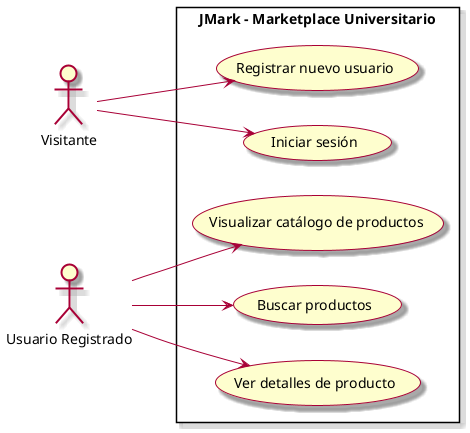

# Casos de Uso

## Diagrama de Casos de Uso

## Listado de Casos de Uso

| #    | Nombre                                                                       |
|------|------------------------------------------------------------------------------|
| CU01 | [Registrar nuevo usuario](casos-de-uso/CU01-Registrar-nuevo-usuario.md)      |
| CU02 | [Iniciar sesión](casos-de-uso/CU02-Iniciar-sesion.md)                        |
| CU03 | [Registrar nuevos productos](casos-de-uso/CU03-Registrar-Producto.md)        |
| CU04 | [Visualizar catalogo de productos](casos-de-uso/CU04-Visualizar-catalogo.md) |
